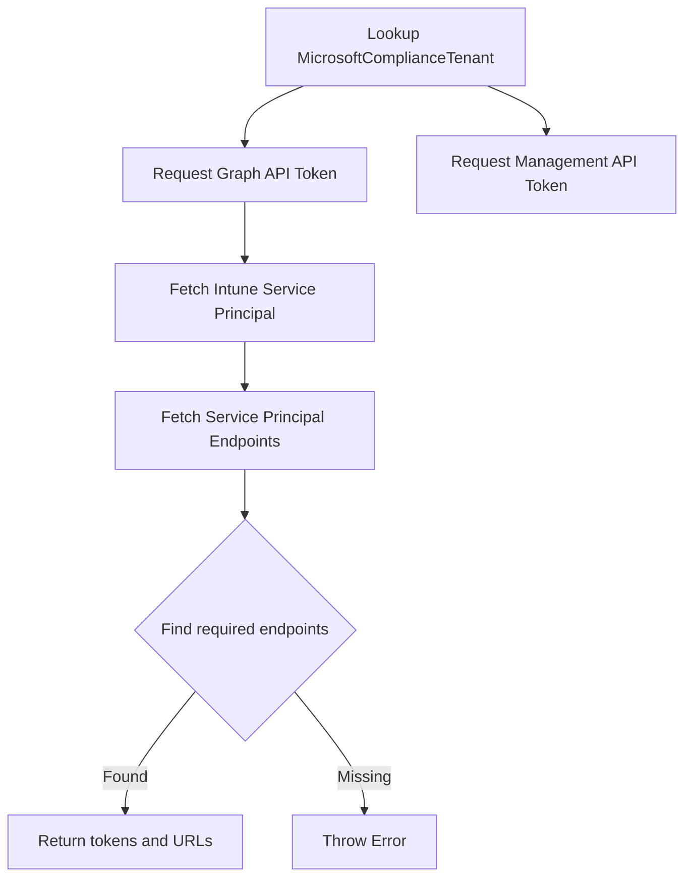

<!-- source-hash: db59b0462dc77f261474241dba45e8b2 -->
Retrieves OAuth2 access tokens and API endpoint URLs required for interacting with a Microsoft compliance tenant via the Graph API and Intune Management API.

## Key Components

- **Input:** `complianceTenantRecordId` — ID of the `MicrosoftComplianceTenant` record to authenticate against
- **Output:** Object containing:
  - `graphAccessToken` — Bearer token for Microsoft Graph API calls
  - `manageApiAccessToken` — Bearer token for the Intune Management API (`api.manage.microsoft.com`)
  - `tenantDataSyncUrl` — Endpoint URI for `PartnerTenantDataSyncService`
  - `deviceDataSyncUrl` — Endpoint URI for `PartnerDeviceDataSyncService`

**Configuration dependencies:**
- `sails.config.custom.compliancePartnerClientId`
- `sails.config.custom.compliancePartnerClientSecret`

## Flow



## Usage Example

```javascript
let result = await sails.helpers.microsoft.getAccessTokenAndApiUrls
  .with({ complianceTenantRecordId: 42 });

// result.graphAccessToken      → used for Graph API requests
// result.manageApiAccessToken  → used for Intune Management API requests
// result.tenantDataSyncUrl     → PartnerTenantDataSyncService endpoint
// result.deviceDataSyncUrl     → PartnerDeviceDataSyncService endpoint
```

> **References:** [Microsoft Graph Service Principals](https://learn.microsoft.com/en-us/graph/api/resources/serviceprincipal) · [List Endpoints](https://learn.microsoft.com/en-us/graph/api/group-list-endpoints)