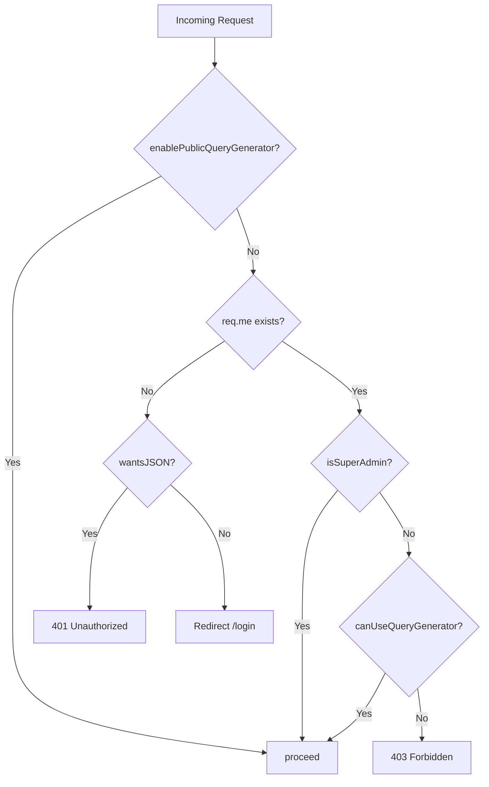

<!-- source-hash: beb271073043a19db89aebac11c6607d -->
Sails.js middleware policy that gates access to the query generator feature based on public configuration flags and per-user permissions.

## Key Components

- **`enablePublicQueryGenerator`** – Config flag (`sails.config.custom.enablePublicQueryGenerator`) that bypasses all access checks when the feature is opened to the public
- **Authentication check** – Redirects unauthenticated users to `/login` (or returns `401` for JSON requests)
- **Authorization check** – Allows access if the user is a super admin (`req.me.isSuperAdmin`) or has been explicitly granted access (`req.me.canUseQueryGenerator`); otherwise returns `403 Forbidden`

## Access Control Flow



## Usage Example

Register the policy in `config/policies.js` to protect a controller action:

```javascript
// config/policies.js
module.exports.policies = {
  'QueryGeneratorController': {
    '*': ['is-logged-in', 'has-query-generator-access'],
  },
};
```

> **Note:** This policy is marked as temporary (`// FUTURE: remove this policy once the query generator is public`). Once `enablePublicQueryGenerator` is permanently enabled, this middleware can be removed. See the [Sails.js policies docs](https://sailsjs.com/docs/concepts/policies) for more context.

**Source:** [`has-query-generator-access.js`](https://github.com/flamingo-stack/fleetmdm/blob/main/has-query-generator-access.js)