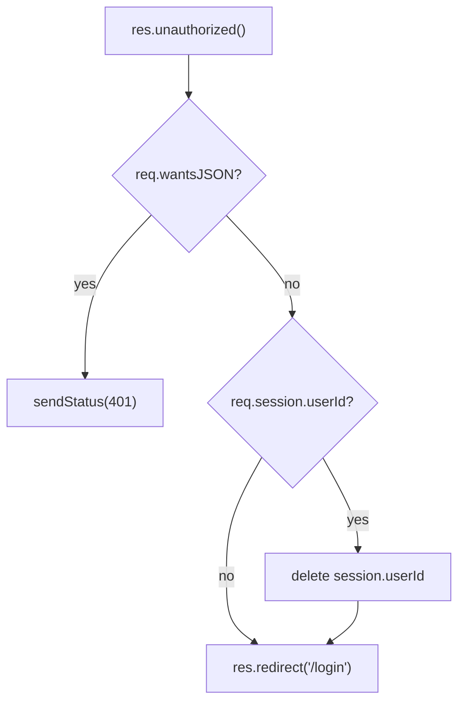

<!-- source-hash: 0a0e91ab2b81d7386ace4425b5aaf2e3 -->
A custom Sails.js response handler that content-negotiates unauthorized access by either returning a `401` status for API/JSON clients or redirecting browser clients to the login page.

## Key Components

- **`unauthorized()`** — Custom response function attached to `res.unauthorized()`, handling two scenarios:
  - **JSON clients** (`req.wantsJSON`): Returns HTTP `401 Unauthorized` with no body
  - **Browser clients**: Clears the `userId` session if present, then redirects to `/login`

## Usage Example

```javascript
// In a controller action
return res.unauthorized();

// With actions2 exits
exits: {
  badCombo: {
    description: 'That email address and password combination is not recognized.',
    responseType: 'unauthorized'
  }
}
```

## Behavior



**Source:** [`api/responses/unauthorized.js`](https://github.com/flamingo-stack/fleetmdm/blob/main/api/responses/unauthorized.js)