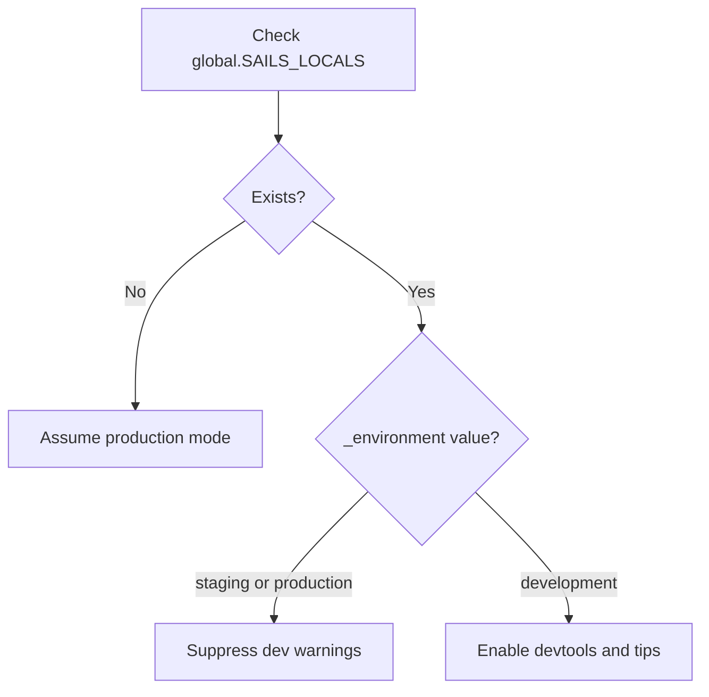

<!-- source-hash: 757b5c243f1fe2c115c3de24e24c7ef0 -->
A modified distribution of Vue.js v2.5.17 that integrates with the Sails.js framework by using the `SAILS_LOCALS` global to automatically detect the runtime environment and suppress unnecessary development warnings in production/staging.

## Key Components

| Component | Description |
|---|---|
| `IS_VUE_RUNNING_IN_PRODUCTION_OR_STAGING_OR_ON_ERR_PAGE` | Runtime flag derived from `SAILS_LOCALS._environment` to control dev/prod mode |
| `config` | Global Vue configuration object (devtools, productionTip, errorHandler, etc.) |
| Utility helpers | `camelize`, `hyphenate`, `capitalize`, `extend`, `looseEqual`, `once`, `cached` |
| `LIFECYCLE_HOOKS` | Array of all Vue lifecycle hook names |
| `ASSET_TYPES` | Registered asset types: `component`, `directive`, `filter` |

## Environment Detection Logic



## Usage Example

This file is a drop-in replacement for standard Vue.js. It auto-detects environment via `SAILS_LOCALS`:

```javascript
// In a Sails.js app, SAILS_LOCALS is injected server-side:
// { _environment: 'production', ... }

// Dev warnings are suppressed automatically in production/staging.
// No manual Vue.config changes needed:
var app = new Vue({
  el: '#app',
  data: { message: 'Hello Fleet!' }
});

// In development, devtools and productionTip behave normally.
// In production/staging, they are silenced automatically.
```

## Source

[`vue.js`](https://github.com/flamingo-stack/fleetmdm/blob/main/vue.js) — Part of the [flamingo-stack/fleetmdm](https://github.com/flamingo-stack/fleetmdm) repository.