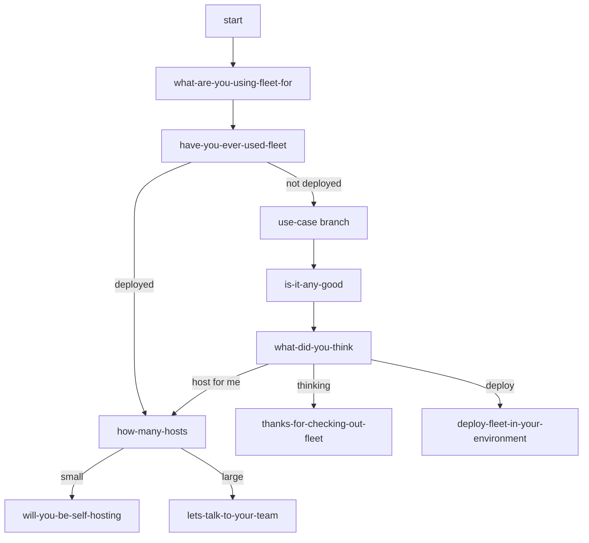

<!-- source-hash: ff7eb83aaf868191850d7767098fd205 -->
Registers and controls the multi-step onboarding questionnaire page for Fleet, managing step navigation, form validation, and progress persistence via API calls.

## Key Components

- **`data`** – Tracks `currentStep`, per-step `formData`, `formErrors`, form validation rules, `primaryBuyingSituation`, and `psychologicalStage`
- **`beforeMount`** – Prefills previously answered questions, applies ad-sourced `primaryBuyingSituation`, syncs `psychologicalStage` from server, and clears URL hash
- **`handleSubmittingForm(argins)`** – Persists current step answers via `Cloud.saveQuestionnaireProgress`, updates local state, then advances to the next step or redirects to a URL
- **`clickGoToPreviousStep()`** – Navigates backward through the questionnaire using a `switch` statement that accounts for branching paths based on prior answers
- **`getNextStep()`** – Computes the next step name (or redirect path) using branching logic based on `primaryBuyingSituation`, `fleetUseStatus`, `numberOfHosts`, and `whatDidYouThink`

## Step Flow (Simplified)



## Usage Example

```javascript
// Step submission triggers handleSubmittingForm with the current step's field values
await this.handleSubmittingForm({ primaryBuyingSituation: 'eo-security' });
// → saves progress to server, advances currentStep to next questionnaire step

// Going back one step
await this.clickGoToPreviousStep();
// → updates this.currentStep based on branching history

// Computing the next step without submitting
let next = this.getNextStep();
// → returns a step name like 'is-it-any-good' or a path like '/announcements'
```