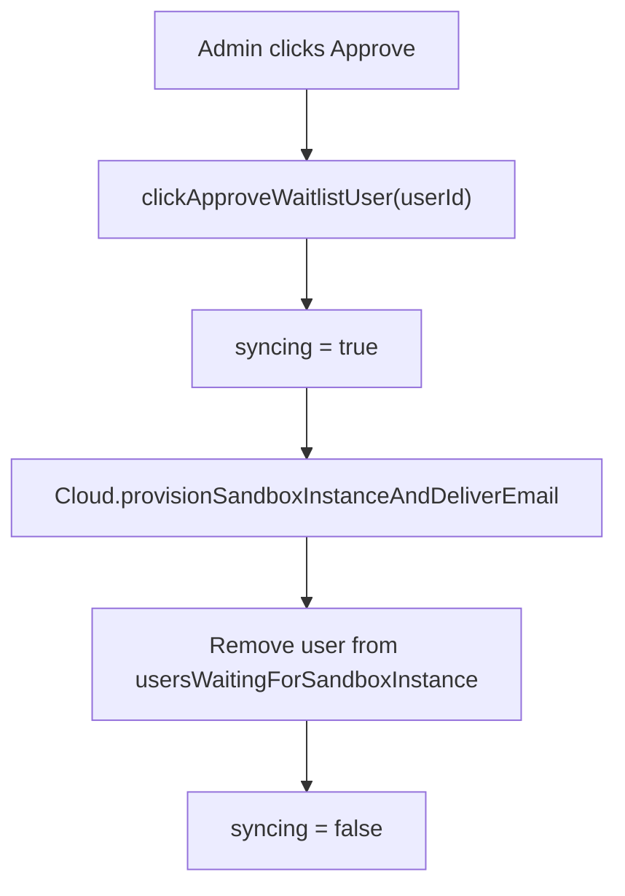

<!-- source-hash: 77745051e9ce436ebf56bfd5c0d9282a -->
Registers the `sandbox-waitlist` parasails page, providing admin functionality to approve users on the sandbox instance waitlist.

## Key Components

| Component | Description |
|-----------|-------------|
| `data.syncing` | Boolean flag tracking in-progress async operations |
| `clickApproveWaitlistUser` | Approves a waitlisted user by provisioning a sandbox instance and sending a notification email |

## Usage Example

```javascript
// Triggered when an admin clicks "Approve" for a waitlisted user
await this.clickApproveWaitlistUser(userId);
// Calls Cloud.provisionSandboxInstanceAndDeliverEmail,
// then removes the approved user from the local waitlist array
```

## Flow



## Notes

- `usersWaitingForSandboxInstance` is expected to be available as page data (injected server-side via `locals`)
- The `syncing` flag can be used in the template to disable the approve button and prevent duplicate submissions
- Source: [`sandbox-waitlist.page.js`](https://github.com/flamingo-stack/fleetmdm/blob/main/sandbox-waitlist.page.js)