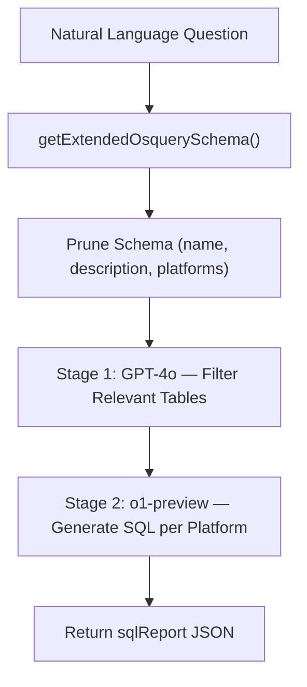

<!-- source-hash: 993189b5ea065970f8eacc2df0d078ed -->
A Sails.js machine/helper that converts natural language questions into osquery SQL queries using a two-stage LLM pipeline — first filtering the osquery schema to relevant tables, then generating platform-specific SQL.

## Key Components

| Component | Description |
|---|---|
| `naturalLanguageQuestion` | Required string input — the IT admin's question in plain English |
| `schemaFiltrationPrompt` | Stage 1 LLM call (GPT-4o) that narrows the full osquery schema to relevant tables |
| `sqlPrompt` | Stage 2 LLM call (o1-preview) that generates platform-specific SQL from the filtered schema |
| `sqlReport` | JSON output containing queries and caveats for macOS, Windows, Linux, and ChromeOS |

## Two-Stage Pipeline



## Usage Example

```javascript
// Called as a Sails helper (machine runner)
const result = await sails.helpers.testLlmGeneratedSql.with({
  naturalLanguageQuestion: 'Which of my computers do not have FileVault enabled?'
});

// Returns structured JSON:
// {
//   macOSQuery: "SELECT 1 FROM disk_encryption WHERE ...",
//   windowsQuery: "",
//   linuxQuery: "",
//   chromeOSQuery: "",
//   macOSCaveats: "...",
//   windowsCaveats: "Not applicable",
//   ...
// }
```

## SQL Generation Rules

The Stage 2 prompt enforces strict constraints on generated SQL:

- No `AS` aliases — always use full table names
- Use `LIKE` for application/program matching
- Yes/no questions return 1 row (match) or 0 rows (no match)
- Only use columns and tables valid for each target platform

## Source

[`test-llm-generated-sql.js`](https://github.com/flamingo-stack/fleetmdm/blob/main/test-llm-generated-sql.js)