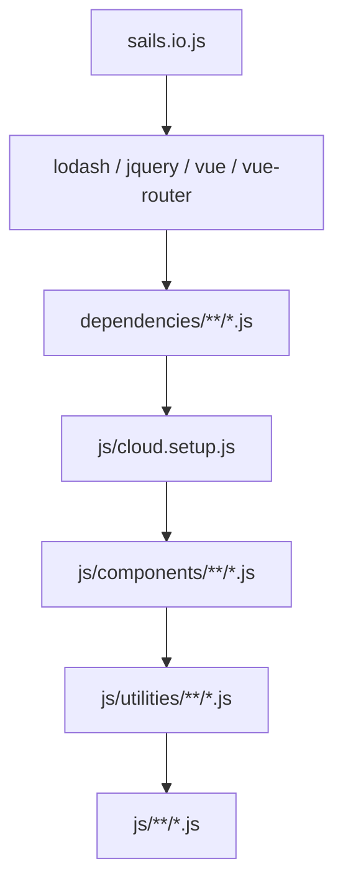

<!-- source-hash: 82d703370f797e8227b961b40e54b558 -->
Defines the asset injection order for CSS, JavaScript, and HTML template files in the Sails.js Grunt-based build pipeline, mapping glob patterns to their resolved `.tmp/public/` output paths.

## Key Components

| Export | Type | Description |
|---|---|---|
| `cssFilesToInject` | `string[]` | Ordered glob patterns for CSS files — dependencies first, then custom styles |
| `jsFilesToInject` | `string[]` | Ordered glob patterns for JS files — `sails.io`, vendor libs, app config, components, utilities, then remaining scripts |
| `templateFilesToInject` | `string[]` | Glob patterns for client-side HTML templates precompiled via JST |

**Load order for `jsFilesToInject`:**



## Usage Example

```javascript
// Consumed by Grunt tasks (e.g. grunt-sails-linker)
var pipeline = require('./tasks/pipeline');

// Resolved paths are prefixed with .tmp/public/
console.log(pipeline.cssFilesToInject);
// ['.tmp/public/dependencies/**/*.css', '.tmp/public/styles/**/*.css']

console.log(pipeline.jsFilesToInject);
// ['.tmp/public/dependencies/sails.io.js', ...]

// Negation patterns (!) are handled automatically
// e.g. '!styles/skip.css' → '!.tmp/public/styles/skip.css'
```

> To customize load order, prepend additional glob entries **above** the catch-all `**/*.js` or `**/*.css` entries. Templates resolve relative to `assets/` rather than `.tmp/public/`.