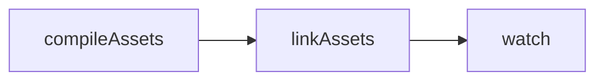

<!-- source-hash: b071d5b9d2e565dbabe48f2d1ca02a33 -->
Registers the default Grunt task pipeline that runs automatically during development when executing `grunt` or starting the app with `sails lift`.

## Key Components

- **`default` task** — Grunt task sequence that chains `compileAssets`, `linkAssets`, and `watch` for a live development workflow
- **Optional transpilation** — Commented-out `polyfill:dev` and `babel` steps available for broader browser compatibility

## Task Execution Order



## Usage Example

```bash
# Runs the default task implicitly
grunt

# Or triggered automatically via Sails in development
sails lift
```

To enable Babel transpilation during development, uncomment the relevant lines:

```javascript
grunt.registerTask('default', [
  'polyfill:dev',   // enable broader browser polyfills
  'compileAssets',
  'babel',          // enable ES6+ transpilation
  'linkAssets',
  'watch'
]);
```

## Notes

- Only runs in **development** mode; production uses a separate Grunt task pipeline
- The `watch` step keeps the process alive, recompiling assets on file changes
- See also: [Sails anatomy reference](https://sailsjs.com/anatomy/tasks/register/default.js) and the full task registry at [`tasks/register/`](https://github.com/flamingo-stack/fleetmdm/blob/main/tasks/register/)